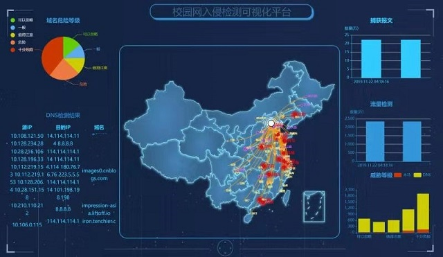
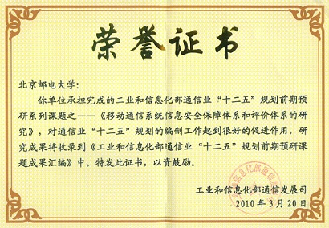

## Biography

**谷勇浩**，毕业于北京邮电大学，工学博士。现为北京邮电大学计算机学院硕士生导师，CCF会员，中国互联网协会首批特聘青年专家。目前研究方向为：网络及信息安全。主持参与国家级、省部级及企业资助的科研项目10多项，包括：863项目，国家自然科学基金，国家242信息安全专项，发改委重大专项，工信部“十二五”前期预研课题，科技部重大专项，公安部重点实验室开放课题基金、工信部通信软课题研究、华为基金、中兴基金、CCF-绿盟鲲鹏基金、IBM高校合作项目、阿里巴巴高校合作项目等。在IEEE等国内外学术期刊和学术会议上发表论文50余篇（SCI、EI检索类论文30多篇），申请专利30余项。国际学术会议IEEE International Conference on Progress in Informatics and Computing 的程序委员会委员，“IEEE ACCESS”、“IEEE/ACM Transactions on Networking”、“International Journal of Distributed Sensor Networks”、“通信学报”等多个国内外重要期刊审稿人，《软件》杂志特邀编委。

## Teaching

大学计算机基础、Java高级语言程序设计、C语言课程设计

## Projects

> 1、核心网DPI技术研究及原型系统
>
> 2、基于异构数据挖掘的威胁分析及攻击发现技术研究
>
> 3、无线移动环境下信息安全监控
>
> 4、DDoS攻击检测技术研究
>
> 5、基于机器学习的恶意域名及僵尸网络检测技术
>
> 6、WebShell检测技术的研究
>
> 7、基于终端行为数据的入侵检测技术研究与开发
>
> 8、基于机器学习的钓鱼网站检测技术研究
>
> 9、恶意软件检测及对抗技术研究
>
> 10、IP地址溯源

### 校园网入侵检测可视化展示平台

## Publications

* Yonghao Gu, Kaiyue Li, Zhenyang Guo, Yongfei Wang. Semi-supervised K-means DDoS Detection Method Using Hybrid Feature Selection Algorithm. IEEE ACCESS, vol. 7, pp. 64351-64365, 2019. 
* Yonghao Gu, Yongfei Wang, Zhen Yang and Yimu Gao. A Distributed Privacy-Utility Tradeoff Method Using Distributed Lossy Source Coding with Side Information. KSII Transactions on Internet and Information Systems, vol. 11, no. 5, pp. 2778-2791, 2017.
* Yonghao Gu, Yongfei Wang, Zhen Yang, Fei Xiong, and Yimu Gao, “Multiple-Features-Based Semisupervised Clustering DDoS Detection Method,” Mathematical Problems in Engineering, vol. 2017, Article ID 5202836, 10 pages, 2017.
*	Gu, Yong-Hao; Guo, Da; Lin, Jiu-Chuan. Energy-saving privacy data secure aggregation method. Journal on Communications. 2014, 35(Z2) : 112-116.
* Yonghao, Gu; Weiming, Wu. A Light-weight Mutual Authentication Protocol for ISO18000-6B Standard RFID System. 2009 IEEE International Conference on Communications Technology and Applications (IEEE ICCTA2009), Beijing, China. October 16-18, 2009. pp : 21-25.
* Gu Yonghao, Wu Weiming. Mutual Authentication Protocol based on Tag ID Number Updating for Low-cost RFID. 2009 IEEE International Conference on Network Infrastructure and Digital Content (IEEE IC-NIDC 2009), Beijing, China. November 6-8, 2009. pp: 548-551.
* Gu Yonghao, Wu Weiming. DDoS detection and prevention based on joint entropy and conditional entropy. Key Engineering Materials Vols. 474-476 (2011) pp: 2129-2133.
* Gu Yonghao. A Quantifying Method for Trade-off between Privacy and Utility. IET International Conference on Information and Communications Technologies. Apr. 27-29, 2013. pp:270-273.
* Gu Yong-hao. An Automatically Privacy Setting Algorithm based on Rasch Model. The Journal of China Universities of Posts and Telecommunications. 2013, 20(S2) : 17-20.
* 谷勇浩,林九川.基于多变量信源编码的隐私效用均衡方法.通信学报,2015,36(12):172-177.
* 谷勇浩,林九川,郭 达.基于聚类的动态社交网络隐私保护方法.通信学报,2015,36(Z1):126-130.

## Patents

* 隐私数据自动设置方法和装置。专利号：201310413660.8
* 低能耗的安全数据融合方法和装置。专利号：201310413722.5
* 一种基于有监督学习的多级钓鱼网站检测方法及检测系统。申请号：201811224807.8
* 一种WebShell检测方法。申请号：201810267006.3
* 基于集成学习的Fast-flux域名检测方法。申请号：201911013025.4
* 基于混合方法的三层钓鱼网站检测系统。申请号：201911013051.7
* 基于混合学习的Domain-flux僵尸网络检测方法。申请号：201910449046.4
* 一种检测网络攻击的方法和设备。专利号：200810144463.X
* 分布式拒绝服务检测防御方法及网络设备。专利号：200810167441.5
* 一种检测低速率拒绝服务攻击的方法及装置。专利号： 200910085344.6
* 一种分布式入侵检测方法、装置和系统。专利号：200910109363.8

## Awards

